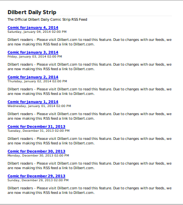

# node-comics-feed

RSS feeds of comics sites usually contains the links to a webpage but not the strip images.  
This module iterates on the items on a feed and parse the webpages to create a new feed with embedded comic strips.

Supported websites:

* GoComics
* Dilbert.com
* Explosm.net

> The list of parsers is meant to be extensible, see [`lib/parser.js`](lib/parsers.js).  
> PRs are welcome.

Inspired by [gocomics-scrape](https://github.com/mihaip/gocomics-scrape) and re-implemented using Node.

## Usage

```sh
npm install comics-feed
comics-feed [.rss|url]
```

Turns [this](http://feed.dilbert.com/dilbert/daily_strip)



into [this](http://leesei-comics-feed.herokuapp.com/embed/http%3A%2F%2Ffeed.dilbert.com%2Fdilbert%2Fdaily_strip)


(rendered by Firefox)

## Parsers

`parsers/*.js` will be installed in plugins in as of 0.0.9.
A parser should have this interface.

```javascript
/**
 * Parser = {
 *   name,
 *   match(),
 *   scrape()
 * }
 *
 * match():
 * @param {Object}   siteUrl  parsed url for the comic strips site
 * Returns whether this scraper can handle this site
 *
 * scrape():
 * @param {String}   baseUrl  url of the webpage containing the comic strip
 * @param {Object}   $        [cheerio](http://matthewmueller.github.io/cheerio/) object containing the parsed page
 * @param {Function} callback callback function to return the parsed strip image URL
 *
 * callback:
 * @param {Object}   error    error object if one occurs
 * @param {String}   img_url  the parsed strip image URL
 *
 */
```

## Tested on

http://feed.dilbert.com/dilbert/daily_strip

http://feeds.feedburner.com/uclick/dilbert-classics

http://feeds.feedburner.com/Explosm (credits to [eguendelman](https://github.com/eguendelman))

## TODO

- error handling
  - invalid URL
  - malformed feed
  - scraping error
- adds pubDate for items
- re-entrance
- module globals cleanup

## SAAS on Heroku

[heroku-comics-feed](https://github.com/leesei/heroku-comics-feed) uses this module to provide a subscribable RSS service.
